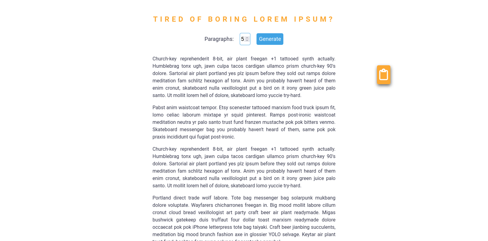

# Lorem Ipsum Text Generator with Copy-to-Clipboard

This simple web application generates Lorem Ipsum text, commonly used as placeholder text in web design and development. It also includes a convenient "Copy to Clipboard" button for easy use.

## Features

    * Generate Lorem Ipsum text with varying paragraph and sentence counts.
    * Copy the generated text to your clipboard with a single click.
    * Clean and user-friendly interface.

## How to Use

    1. Open the application in your web browser.
    2. Choose the desired number of paragraphs and sentences using the input fields.
    3. Click the "Generate" button.
    4. The generated Lorem Ipsum text will appear in the output area.
    5. Click the "Copy to Clipboard" button to copy the text.

## Technical Details

## Screenshot

This application is built using HTML, CSS, and JavaScript. The "Copy to Clipboard" functionality relies on modern browser APIs and might not work in older browsers.

## License

This project is licensed under the MIT License. Please refer to the LICENSE file for details.

## Contributing

We welcome contributions to this project! Feel free to fork the repository and submit pull requests with your improvements.

## Acknowledgements

This project was inspired by the Hipster Ipsum generator. Visit their website for more information: https://hipsum.co